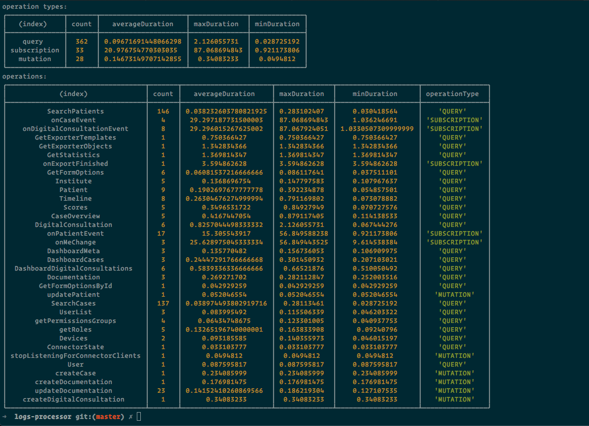
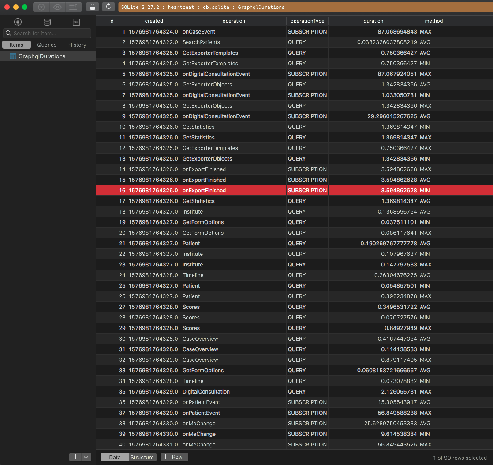

## Overview
The program read log file as a stdin and NodeJS streams are compatible with the stdin. So no need to handle filesystem code. It can easily process larger file without any problem(until defined variable's memory allocation exceeds). Saved data to sqlite for simplicity and portability. 

## Install packages
```
npm i
```

## How to run

After `cat` command place your log file path.
```
cat logs.log | node cli.js
```

## Screenshots

Cli:
<p align="center">
  
</p>

DB:
<p align="center">
  
</p>
